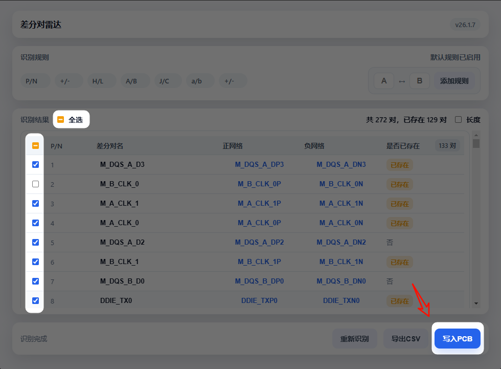
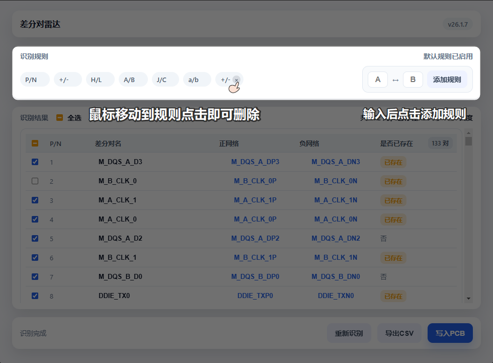
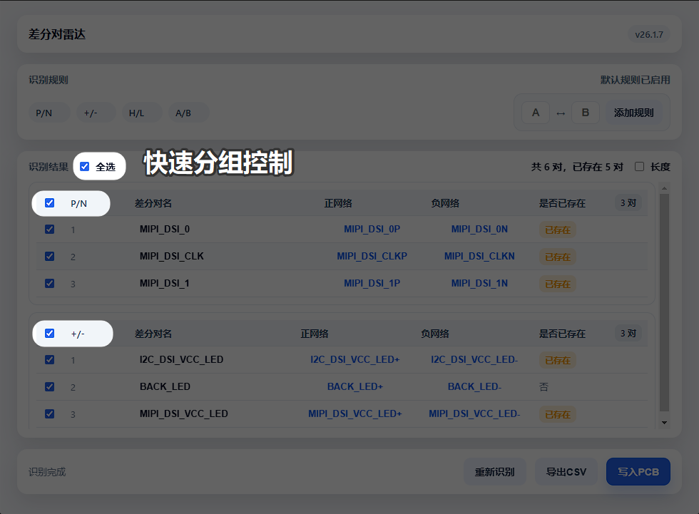
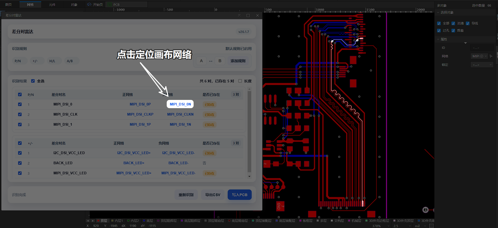
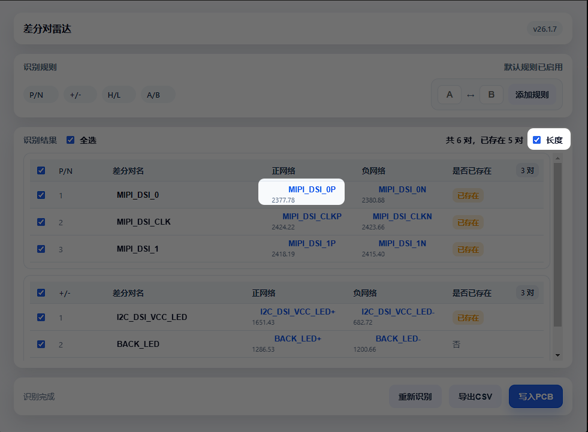
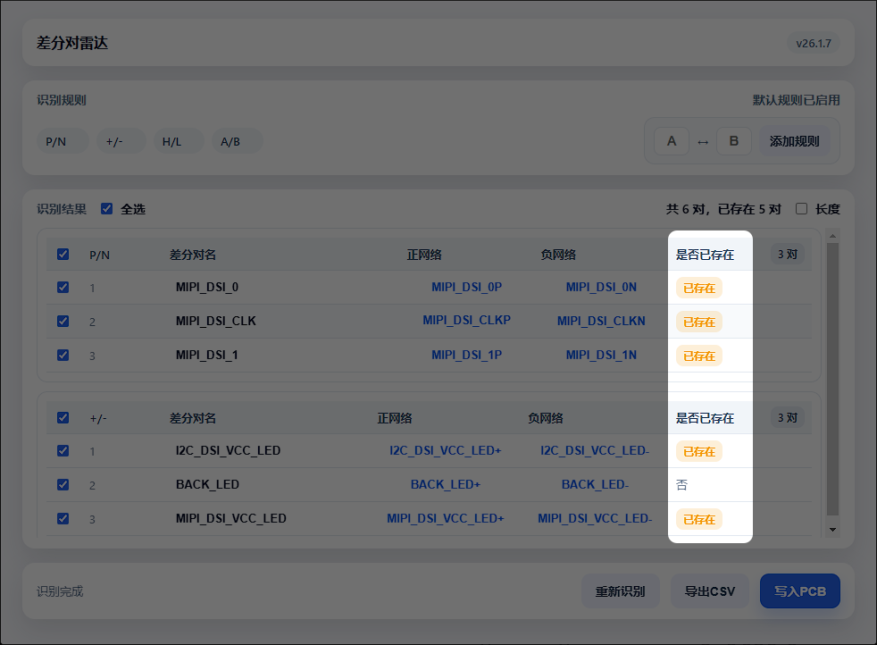
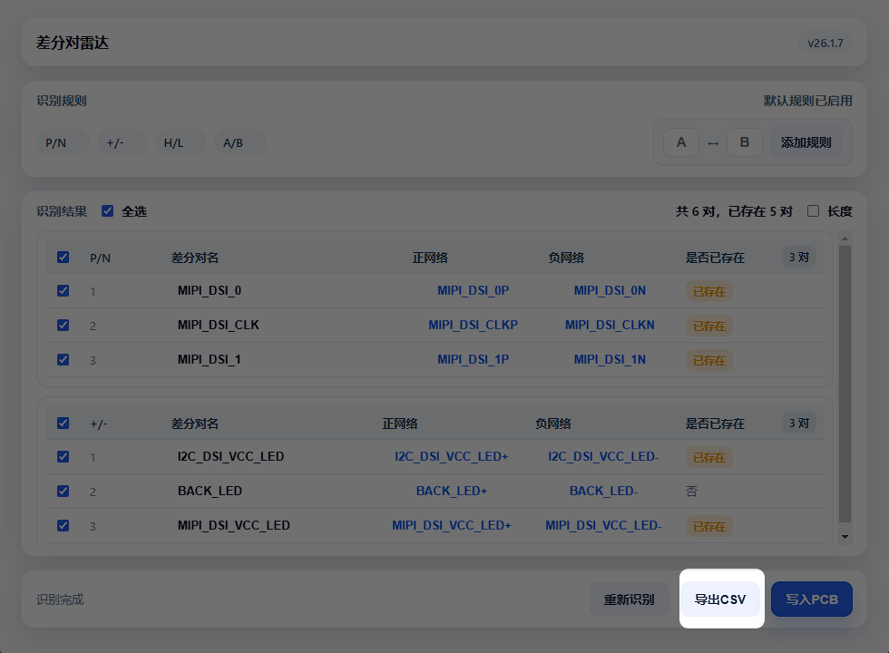

你还在为差分对一个个手动加到手酸而担心吗？  
你还在为“特殊中缀”识别不到而夜不能寐吗？  
快来使用差分对雷达，一键识别、一键写入，守护你的腱鞘炎。

## 卖点

自动识别 PCB 差分对，表格化管理，勾选则写入，专治手动重复劳动。

## 识别规则

- 匹配逻辑：仅有一个字符不同，其余字符完全一致
- 差分字符位置不限，前缀/中缀/后缀都能识别

## 功能清单

- 默认规则自动识别：P/N、+/−、H/L、A/B
- 支持自定义规则与删除默认规则
- 结果按规则分组，勾选更直观
- 差分对名可编辑，网络可定位与高亮
- 网络长度可一键展开
- 已存在差分对显著标记
- 支持导出识别结果 CSV
- 一键写入并自动保存 PCB

## 功能详情

### 一键识别与写入

识别结果勾选后直接写入 PCB，快到让你怀疑人生。  

### 规则管理

默认规则开箱即用，自定义规则随手添加，默认规则也可删除。  

### 分组表格与勾选

按规则分组，勾选成批操作，拒绝“逐条点点点”。  

### 网络定位与高亮

点网络名即可定位并高亮，不再迷路。  

### 网络长度双行显示

长度在网络名下方，信息密度更高。  

### 已存在标记

已有差分对一眼可见。  

### 导出 CSV

一键导出识别结果，方便留档与协作。  

## 使用方式

1. 打开 PCB 文件
2. 顶部菜单点击 差分对雷达 → 差分对雷达
3. 插件自动识别并展示分组结果
4. 按需勾选，点击 写入PCB
